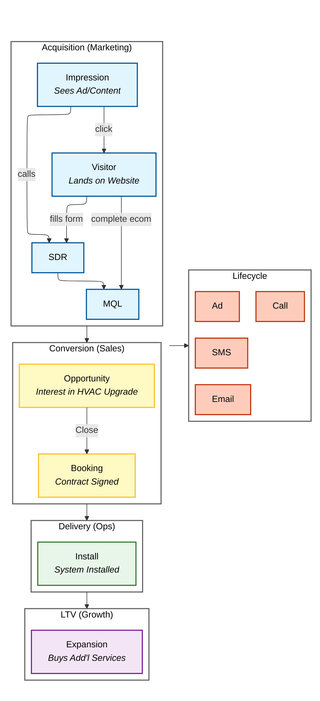

# Stages

High level stages of a marketing and sales funnel

```mermaid
%%{init: {"flowchart": {"defaultRenderer": "elk"}} }%%
flowchart LR
    %% Define Node Styles
    classDef marketing fill:#e1f5fe,stroke:#01579b,stroke-width:2px,color:#000
    classDef sales fill:#fff9c4,stroke:#fbc02d,stroke-width:2px,color:#000
    classDef ops fill:#e8f5e9,stroke:#2e7d32,stroke-width:2px,color:#000
    classDef growth fill:#f3e5f5,stroke:#7b1fa2,stroke-width:2px,color:#000
    classDef lifecycle fill:#ffccbc,stroke:#bf360c,stroke-width:2px,color:#000
    %% Invisible Wrapper Subgraph
    subgraph Funnel [" "]
        direction TB
        
        subgraph S1 ["Acquisition (Marketing)"]
            direction TB
            A[Impression<br/><i>Sees Ad/Content</i>]:::marketing
            B[Visitor<br/><i>Lands on Website</i>]:::marketing
            N[SDR]:::marketing
            D[MQL]:::marketing
            A -->|click| B
            A -->|calls| N
            B -->|fills form| N
            B -->|complete ecom| D
            N --> D
        end
        style S1 fill:#ffffff,stroke:#666,stroke-width:2px,color:#000
        subgraph S2 ["Conversion (Sales)"]
            direction TB
            E[Opportunity<br/><i>Interest in HVAC Upgrade</i>]:::sales
            F[Booking<br/><i>Contract Signed</i>]:::sales
            E -->|Close| F
        end
        style S2 fill:#ffffff,stroke:#666,stroke-width:2px,color:#000
        subgraph S3 ["Delivery (Ops)"]
            direction TB
            G[Install<br/><i>System Installed</i>]:::ops
        end
        style S3 fill:#ffffff,stroke:#666,stroke-width:2px,color:#000
        subgraph S4 ["LTV (Growth)"]
            direction TB
            H[Expansion<br/><i>Buys Add'l Services</i>]:::growth
        end
        style S4 fill:#ffffff,stroke:#666,stroke-width:2px,color:#000
        %% Internal Subgraph Connections
        S1 --> S2
        S2 --> S3
        S3 --> S4
    end
    style Funnel fill:transparent,stroke:transparent
    subgraph S5 ["Lifecycle"]
        direction LR
        I[Email]:::lifecycle
        J[SMS]:::lifecycle
        K[Call]:::lifecycle
        L[Ad]:::lifecycle
    end
    style S5 fill:#ffffff,stroke:#666,stroke-width:2px,color:#000
    %% Wrapper to Lifecycle Connection
    Funnel --> S5
```