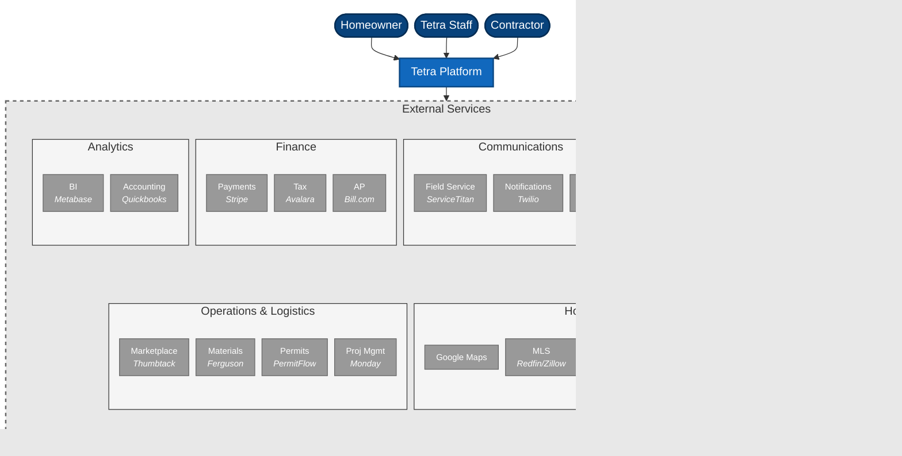

# Context

C4 context diagram vision.

```mermaid

%%{init: { "flowchart": { "nodeSpacing": 10, "rankSpacing": 20, "padding": 0, "subGraphTitleMargin": { "top": 0, "bottom": 2 } } } }%%
flowchart TD
    %% --- STYLING ---
    classDef systemCore fill:#1168bd,stroke:#0b4884,color:#ffffff,stroke-width:2px;
    classDef systemExt fill:#999999,stroke:#666666,color:#ffffff,stroke-width:1px,font-size:12px;
    classDef person fill:#08427b,stroke:#052e56,color:#ffffff,stroke-width:2px,rx:10,ry:10;
    
    %% --- 1. USERS ---
    subgraph Users [" "]
        direction LR
        style Users fill:none,stroke:none
        U_Home([Homeowner]):::person
        U_Tetran([Tetra Staff]):::person
        U_Ext_Pro([Contractor]):::person
    end

    %% --- 2. CORE SYSTEM ---
    Tetra[Tetra Platform]:::systemCore

    %% --- 3. EXTERNAL ECOSYSTEM ---
    subgraph Ext_Sys ["External Services"]
        direction LR
        style Ext_Sys fill:#e8e8e8,stroke:#666666,stroke-width:2px,stroke-dasharray: 5 5

        %% --- GROUP 1: LEFT COLUMN ---
        subgraph Ext_Svc_1 [" "]
            direction TB
            %% Updated fill to match parent (#e8e8e8)
            style Ext_Svc_1 fill:#e8e8e8,stroke:none

            %% HOUSING DATA
            subgraph Dom_Housing ["Housing Data"]
                direction TB
                style Dom_Housing fill:#f5f5f5,stroke:#333333,color:#333333
                Ext_Maps[Google Maps]:::systemExt
                Ext_MLS[MLS<br/><i>Redfin/Zillow</i>]:::systemExt
                Ext_Assess[Assessor<br/><i>First Am</i>]:::systemExt
                Ext_GIS[GIS<br/><i>OSM</i>]:::systemExt
                Ext_LLM[Generative AI<br/><i>OpenAI</i>]:::systemExt
            end

            %% OPERATIONS & LOGISTICS
            subgraph Dom_Ops ["Operations & Logistics"]
                direction TB
                style Dom_Ops fill:#f5f5f5,stroke:#333333,color:#333333
                Ext_Market[Marketplace<br/><i>Thumbtack</i>]:::systemExt
                Ext_Mat[Materials<br/><i>Ferguson</i>]:::systemExt
                Ext_Permit[Permits<br/><i>PermitFlow</i>]:::systemExt
                Ext_PM[Proj Mgmt<br/><i>Monday</i>]:::systemExt
            end
        end

        %% --- GROUP 2: RIGHT COLUMN ---
        subgraph Ext_Svc_2 [" "]
            direction TB
            %% Updated fill to match parent (#e8e8e8)
            style Ext_Svc_2 fill:#e8e8e8,stroke:none

            %% SALES & MARKETING
            subgraph Dom_Sales ["Sales & Marketing"]
                direction TB
                style Dom_Sales fill:#f5f5f5,stroke:#333333,color:#333333
                Ext_Ads[Ads<br/><i>Google/FB</i>]:::systemExt
                Ext_CRM[CRM<br/><i>Salesforce</i>]:::systemExt
                Ext_Quote[Quoting<br/><i>Aurora</i>]:::systemExt
            end

            %% COMMUNICATIONS
            subgraph Dom_Comms ["Communications"]
                direction TB
                style Dom_Comms fill:#f5f5f5,stroke:#333333,color:#333333
                Ext_FSM[Field Service<br/><i>ServiceTitan</i>]:::systemExt
                Ext_Notif[Notifications<br/><i>Twilio</i>]:::systemExt
                Ext_Cal[Calendar<br/><i>Calendly</i>]:::systemExt
            end

            %% FINANCE
            subgraph Dom_Fin ["Finance"]
                direction TB
                style Dom_Fin fill:#f5f5f5,stroke:#333333,color:#333333
                Ext_Pay[Payments<br/><i>Stripe</i>]:::systemExt
                Ext_Tax[Tax<br/><i>Avalara</i>]:::systemExt
                Ext_AP[AP<br/><i>Bill.com</i>]:::systemExt
            end

            %% ANALYTICS
            subgraph Dom_Anal ["Analytics"]
                direction TB
                style Dom_Anal fill:#f5f5f5,stroke:#333333,color:#333333
                Ext_BI[BI<br/><i>Metabase</i>]:::systemExt
                Ext_Acc[Accounting<br/><i>Quickbooks</i>]:::systemExt
            end
        end
    end

    %% --- RELATIONSHIPS ---
    U_Home --> Tetra
    U_Tetran --> Tetra
    U_Ext_Pro --> Tetra
    Tetra --> Ext_Sys
```
