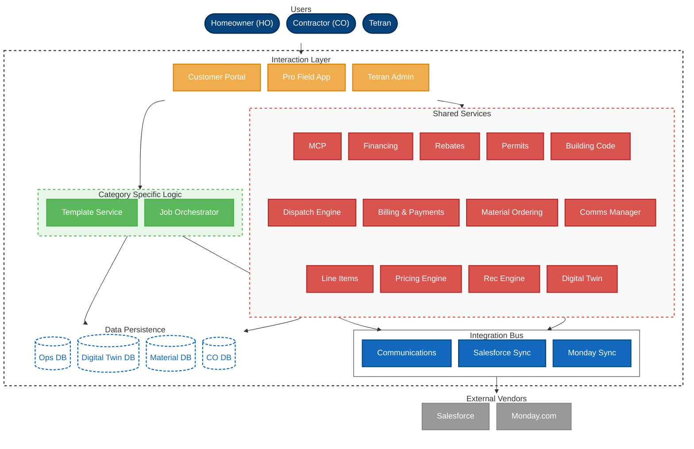

# Container

Vision of future C4 container diagram.

```mermaid

%%{ init: { 'flowchart': { 'rankSpacing': 15, 'nodeSpacing': 15 } } }%%
flowchart TD
    %% --- STYLING ---
    classDef systemCore fill:#1168bd,stroke:#0b4884,color:#ffffff,stroke-width:2px;
    classDef systemExt fill:#999999,stroke:#666666,color:#ffffff,stroke-width:1px;
    classDef person fill:#08427b,stroke:#052e56,color:#ffffff,stroke-width:2px,rx:10,ry:10;
    classDef db fill:#ffffff,stroke:#1168bd,color:#1168bd,stroke-width:2px,stroke-dasharray: 5 3;
    classDef newService fill:#d9534f,stroke:#b52b27,color:#ffffff,stroke-width:2px;
    classDef logicService fill:#5cb85c,stroke:#4cae4c,color:#ffffff,stroke-width:2px;
    classDef app fill:#f0ad4e,stroke:#d58512,color:#ffffff,stroke-width:2px;

    %% --- ACTORS ---
    subgraph Users
        direction TB
        style Users fill:none,stroke:none
        U_Home(["Homeowner (HO)"]):::person
        U_Pro(["Contractor (CO)"]):::person
        U_Staff(["Tetran"]):::person
    end

    %% --- TETRA PLATFORM ---
    subgraph Tetra [" "]
        direction TB
        style Tetra fill:none,stroke:#333333,stroke-width:2px,stroke-dasharray: 5 5

        %% 1. INTERACTION LAYER (Vertical Stack)
        subgraph Interaction ["Interaction Layer"]
            direction TB
            style Interaction fill:none,stroke:none
            App_Portal["Customer Portal"]:::app
            App_Pro["Pro Field App"]:::app
            App_Admin["Tetran Admin"]:::app
            %% Sales Console Removed
        end

        %% 2. CATEGORY SPECIFIC LOGIC
        subgraph CategoryLogic ["Category Specific Logic"]
            direction TB
            style CategoryLogic fill:#e8f5e9,stroke:#5cb85c,stroke-width:2px,stroke-dasharray: 5 5
            
            Svc_Template["Template Service"]:::logicService
            Svc_Orch["Job Orchestrator"]:::logicService
        end

        %% 3. SHARED SERVICES (Rows max 5 nodes)
        subgraph Services ["Shared Services"]
            direction LR
            style Services fill:#f9f9f9,stroke:#d9534f,stroke-width:2px,stroke-dasharray: 5 5

            %% Column 1
            subgraph SvcRow1 [" "]
                direction TB
                style SvcRow1 fill:none,stroke:none
                
                Svc_LineItem["Line Items"]:::newService
                Svc_Pricing["Pricing Engine"]:::newService
                Svc_Rec["Rec Engine"]:::newService
                Svc_Twin["Digital Twin"]:::newService
            end

            %% Column 2
            subgraph SvcRow2 [" "]
                direction TB
                style SvcRow2 fill:none,stroke:none
                
                Svc_Dispatch["Dispatch Engine"]:::newService
                Svc_Billing["Billing & Payments"]:::newService
                Svc_Materials["Material Ordering"]:::newService
                Svc_Comms["Comms Manager"]:::newService
            end

            %% Column 3
            subgraph SvcRow3 [" "]
                direction TB
                style SvcRow3 fill:none,stroke:none

                Svc_MCP["MCP"]:::newService
                Svc_Financing["Financing"]:::newService
                Svc_Rebates["Rebates"]:::newService
                Svc_Permits["Permits"]:::newService
                Svc_BuildingCode["Building Code"]:::newService
            end
        end

        %% 4. INTEGRATION LAYER
        subgraph Integrations ["Integration Bus"]
            direction TB
            style Integrations fill:none,stroke:#333333,stroke-width:1px
            INT_Comm["Communications"]:::systemCore
            INT_SF["Salesforce Sync"]:::systemCore
            INT_Mon["Monday Sync"]:::systemCore
        end

        %% 5. DATA LAYER
        subgraph Data ["Data Persistence"]
            direction TB
            style Data fill:none,stroke:none
            
            DB_Ops[("Ops DB")]:::db
            DB_Twin[("Digital Twin DB")]:::db
            DB_Materials[("Material DB")]:::db
            DB_Network[("CO DB")]:::db
        end
    end

    %% --- EXTERNAL SYSTEMS ---
    subgraph External ["External Vendors"]
        direction TB
        style External fill:none,stroke:none
        Ext_SF["Salesforce"]:::systemExt
        Ext_Mon["Monday.com"]:::systemExt
    end

    %% --- RELATIONSHIPS ---
    Users --> Interaction
    Interaction --> CategoryLogic
    Interaction --> Services
    CategoryLogic --> Data
    CategoryLogic --> Integrations
    Services --> Data
    Services --> Integrations
    Integrations --> External
```