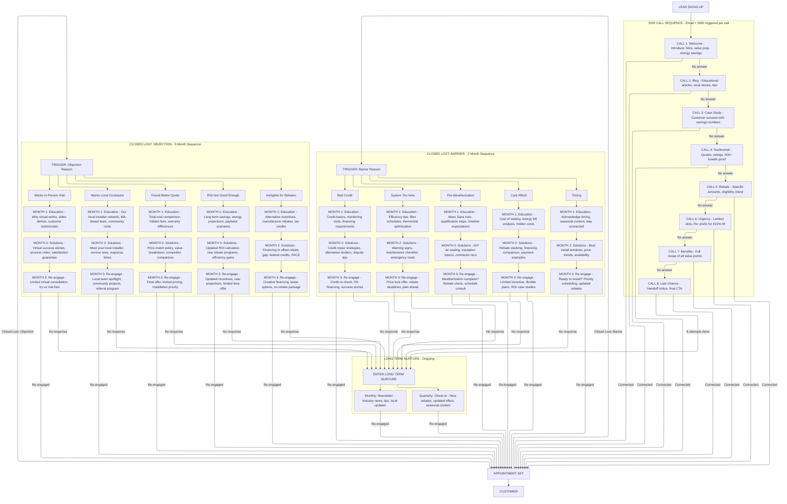

```mermaid

%%{init: {"flowchart": {"defaultRenderer": "elk"}} }%%
flowchart TB
    A["LEAD SIGNS UP"] --> B

    subgraph SDR["SDR CALL SEQUENCE - Email + SMS triggered per call"]
        B["CALL 1: Welcome - Introduce Tetra, value prop, energy savings"]
        B -->|"No answer"| C["CALL 2: Blog - Educational articles, local stories, tips"]
        C -->|"No answer"| D["CALL 3: Case Study - Customer success with savings numbers"]
        D -->|"No answer"| E["CALL 4: Testimonial - Quotes, ratings, 500+ installs proof"]
        E -->|"No answer"| F["CALL 5: Rebate - Specific amounts, eligibility check"]
        F -->|"No answer"| G["CALL 6: Urgency - Limited slots, Re: prefix for 431% lift"]
        G -->|"No answer"| H["CALL 7: Benefits - Full recap of all value points"]
        H -->|"No answer"| I["CALL 8: Last Chance - Handoff notice, final CTA"]
    end

    B -->|"Connected"| J
    C -->|"Connected"| J
    D -->|"Connected"| J
    E -->|"Connected"| J
    F -->|"Connected"| J
    G -->|"Connected"| J
    H -->|"Connected"| J
    I -->|"Connected"| J

    J["APPOINTMENT SET"] --> U["CUSTOMER"]
    J -->|"Closed Lost: Barrier"| CL
    J -->|"Closed Lost: Objection"| OB

    I -->|"8 attempts done"| L

    subgraph CLOSEDLOST["CLOSED LOST: BARRIER - 3 Month Sequence"]
        CL["TRIGGER: Barrier Reason"]
        CL --> R1["Bad Credit"]
        CL --> R2["System Too New"]
        CL --> R3["Pre-Weatherization"]
        CL --> R4["Cant Afford"]
        CL --> R5["Timing"]
        
        R1 --> M1["MONTH 1: Education - Credit basics, monitoring tools, financing requirements"]
        R2 --> M1B["MONTH 1: Education - Efficiency tips, filter schedules, thermostat optimization"]
        R3 --> M1C["MONTH 1: Education - Mass Save intro, qualification steps, timeline expectations"]
        R4 --> M1D["MONTH 1: Education - Cost of waiting, energy bill analysis, hidden costs"]
        R5 --> M1E["MONTH 1: Education - Acknowledge timing, seasonal content, stay connected"]
        
        M1 --> M2["MONTH 2: Solutions - Credit repair strategies, alternative lenders, dispute tips"]
        M1B --> M2B["MONTH 2: Solutions - Warning signs, maintenance checklist, emergency costs"]
        M1C --> M2C["MONTH 2: Solutions - DIY air sealing, insulation basics, contractor recs"]
        M1D --> M2D["MONTH 2: Solutions - Rebate stacking, financing comparison, payment examples"]
        M1E --> M2E["MONTH 2: Solutions - Best install windows, price trends, availability"]
        
        M2 --> M3["MONTH 3: Re-engage - Credit re-check, 0% financing, success stories"]
        M2B --> M3B["MONTH 3: Re-engage - Price lock offer, rebate deadlines, plan ahead"]
        M2C --> M3C["MONTH 3: Re-engage - Weatherization complete? Rebate check, schedule consult"]
        M2D --> M3D["MONTH 3: Re-engage - Limited incentive, flexible plans, ROI case studies"]
        M2E --> M3E["MONTH 3: Re-engage - Ready to revisit? Priority scheduling, updated rebates"]
    end

    subgraph OBJECTION["CLOSED LOST: OBJECTION - 3 Month Sequence"]
        OB["TRIGGER: Objection Reason"]
        OB --> O1["Wants In-Person Visit"]
        OB --> O2["Wants Local Contractor"]
        OB --> O3["Found Better Quote"]
        OB --> O4["ROI Not Good Enough"]
        OB --> O5["Ineligible for Rebates"]
        
        O1 --> P1["MONTH 1: Education - Why virtual works, video demos, customer testimonials"]
        O2 --> P1B["MONTH 1: Education - Our local installer network, MA-based team, community roots"]
        O3 --> P1C["MONTH 1: Education - Total cost comparison, hidden fees, warranty differences"]
        O4 --> P1D["MONTH 1: Education - Long-term savings, energy projections, payback scenarios"]
        O5 --> P1E["MONTH 1: Education - Alternative incentives, manufacturer rebates, tax credits"]
        
        P1 --> P2["MONTH 2: Solutions - Virtual success stories, process video, satisfaction guarantee"]
        P1B --> P2B["MONTH 2: Solutions - Meet your local installer, service area, response times"]
        P1C --> P2C["MONTH 2: Solutions - Price match policy, value breakdown, competitor comparison"]
        P1D --> P2D["MONTH 2: Solutions - Updated ROI calculator, new rebate programs, efficiency gains"]
        P1E --> P2E["MONTH 2: Solutions - Financing to offset rebate gap, federal credits, PACE"]
        
        P2 --> P3["MONTH 3: Re-engage - Limited virtual consultation, try us risk-free"]
        P2B --> P3B["MONTH 3: Re-engage - Local team spotlight, community projects, referral program"]
        P2C --> P3C["MONTH 3: Re-engage - Final offer, locked pricing, installation priority"]
        P2D --> P3D["MONTH 3: Re-engage - Updated incentives, new projections, limited time offer"]
        P2E --> P3E["MONTH 3: Re-engage - Creative financing, lease options, no-rebate package"]
    end

    M3 -->|"Re-engaged"| J
    M3B -->|"Re-engaged"| J
    M3C -->|"Re-engaged"| J
    M3D -->|"Re-engaged"| J
    M3E -->|"Re-engaged"| J

    P3 -->|"Re-engaged"| J
    P3B -->|"Re-engaged"| J
    P3C -->|"Re-engaged"| J
    P3D -->|"Re-engaged"| J
    P3E -->|"Re-engaged"| J

    M3 -->|"No response"| L
    M3B -->|"No response"| L
    M3C -->|"No response"| L
    M3D -->|"No response"| L
    M3E -->|"No response"| L

    P3 -->|"No response"| L
    P3B -->|"No response"| L
    P3C -->|"No response"| L
    P3D -->|"No response"| L
    P3E -->|"No response"| L

    subgraph LONGTERM["LONG TERM NURTURE - Ongoing"]
        L["ENTER LONG TERM NURTURE"]
        L --> LT1["Monthly: Newsletter - Industry news, tips, local updates"]
        L --> LT2["Quarterly: Check-in - New rebates, updated offers, seasonal content"]
    end

    LT1 -->|"Re-engaged"| J
    LT2 -->|"Re-engaged"| J

```