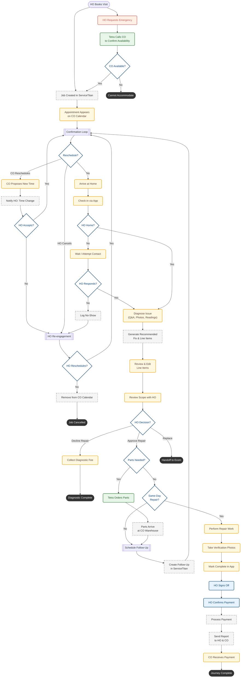

# MVP CO repair user journey

MVP version for the CO repair user journey

```mermaid
flowchart TD
    %% --- STYLING ---
    classDef user fill:#e6f3ff,stroke:#08427b,color:#08427b,stroke-width:2px,rx:5,ry:5;
    classDef co fill:#fff8e1,stroke:#ffa000,color:#5d4037,stroke-width:2px,rx:5,ry:5;
    classDef system fill:#f5f5f5,stroke:#333333,color:#333333,stroke-width:1px,stroke-dasharray: 5 5;
    classDef logic fill:#ffffff,stroke:#08427b,stroke-width:2px,shape:rhombus,color:#08427b;
    classDef alert fill:#fff0e6,stroke:#d9534f,color:#d9534f,stroke-width:2px,rx:5,ry:5;
    classDef terminator fill:#333,stroke:#333,color:#fff,rx:10,ry:10;
    classDef subproc fill:#f4f4f4,stroke:#333,stroke-width:2px;
    classDef tetra fill:#e8f5e9,stroke:#2e7d32,color:#1b5e20,stroke-width:2px,rx:5,ry:5;

    %% --- STEP 1: JOB ASSIGNMENT ---
    StartNode(["HO Books Visit"]) --> Sys_ST["Job Created in ServiceTitan"]:::system
    Sys_ST --> CO_Cal["Appointment Appears<br/>on CO Calendar"]:::co

    %% Emergency Path
    StartNode --> HO_Emerg["HO Requests Emergency"]:::alert
    HO_Emerg --> Tetra_Call["Tetra Calls CO<br/>to Confirm Availability"]:::tetra
    Tetra_Call --> Dec_Avail{"CO Available?"}:::logic
    Dec_Avail -- No --> End_NoAvail(["Cannot Accommodate"]):::terminator
    Dec_Avail -- Yes --> Sys_ST

    %% --- STEP 2: CONFIRMATION LOOP ---
    CO_Cal --> Confirm_Loop
    Confirm_Loop@{ shape: subproc, label: "Confirmation Loop" }

    Confirm_Loop --> Dec_Resched{"Reschedule?"}:::logic
    Dec_Resched -- No --> CO_Arrive

    %% CO Reschedule Path
    Dec_Resched -- "CO Reschedules" --> CO_NewTime["CO Proposes New Time"]:::co
    CO_NewTime --> Sys_Notify_HO["Notify HO: Time Change"]:::system
    Sys_Notify_HO --> Dec_HO_Accept{"HO Accepts?"}:::logic
    Dec_HO_Accept -- Yes --> Confirm_Loop
    Dec_HO_Accept -- No --> Proc_Reengage

    %% HO Cancels Path
    Dec_Resched -- "HO Cancels" --> Proc_Reengage
    Proc_Reengage@{ shape: subproc, label: "HO Re-engagement" }
    Proc_Reengage --> Dec_Reengage{"HO Reschedules?"}:::logic
    Dec_Reengage -- Yes --> Confirm_Loop
    Dec_Reengage -- No --> Sys_Remove["Remove from CO Calendar"]:::system
    Sys_Remove --> End_Cancelled(["Job Cancelled"]):::terminator

    %% --- STEP 3: ARRIVAL ---
    CO_Arrive["Arrive at Home"]:::co
    CO_Arrive --> CO_Checkin["Check-in via App"]:::co
    CO_Checkin --> Dec_HO_Home{"HO Home?"}:::logic

    %% HO No-Show Path
    Dec_HO_Home -- No --> CO_Wait["Wait / Attempt Contact"]:::co
    CO_Wait --> Dec_NoShow{"HO Responds?"}:::logic
    Dec_NoShow -- No --> Sys_Log_NoShow["Log No-Show"]:::system
    Sys_Log_NoShow --> Proc_Reengage
    Dec_NoShow -- Yes --> CO_Diagnose

    Dec_HO_Home -- Yes --> CO_Diagnose

    %% --- STEP 4: DIAGNOSIS ---
    CO_Diagnose["Diagnose Issue<br/>(Q&A, Photos, Readings)"]:::co
    CO_Diagnose --> Sys_Gen["Generate Recommended<br/>Fix & Line Items"]:::system
    Sys_Gen --> CO_Review["Review & Edit<br/>Line Items"]:::co
    CO_Review --> CO_Present["Review Scope with HO"]:::co

    %% --- STEP 5: REPAIR DECISION ---
    CO_Present --> Dec_Repair{"HO Decision?"}:::logic

    %% Path A: No Repair
    Dec_Repair -- "Decline Repair" --> CO_Collect_Diag["Collect Diagnostic Fee"]:::co
    CO_Collect_Diag --> End_DiagOnly(["Diagnostic Complete"]):::terminator

    %% Path B: Approve Repair
    Dec_Repair -- "Approve Repair" --> Dec_Parts{"Parts Needed?"}:::logic

    %% Path C: Replace
    Dec_Repair -- "Replace" --> End_Ecom(["Handoff to Ecom"]):::terminator

    %% --- STEP 6: PARTS DECISION ---
    Dec_Parts -- No --> Dec_SameDay{"Same-Day<br/>Repair?"}:::logic
    Dec_SameDay -- Yes --> CO_Execute
    Dec_SameDay -- No --> Sched_Loop

    Dec_Parts -- Yes --> Tetra_Order["Tetra Orders Parts"]:::tetra
    Tetra_Order --> Parts_Arrive["Parts Arrive<br/>at CO Warehouse"]:::system
    Parts_Arrive --> Sched_Loop

    %% Scheduling Loop (reuses confirmation)
    Sched_Loop@{ shape: subproc, label: "Schedule Follow-Up" }
    Sched_Loop --> Sys_ST_Followup["Create Follow-Up<br/>in ServiceTitan"]:::system
    Sys_ST_Followup --> Confirm_Loop

    %% --- STEP 7: EXECUTION ---
    CO_Execute["Perform Repair Work"]:::co
    CO_Execute --> CO_Photo["Take Verification Photos"]:::co
    CO_Photo --> CO_Complete["Mark Complete in App"]:::co

    %% --- STEP 8: COMPLETION ---
    CO_Complete --> HO_Sign["HO Signs Off"]:::user
    HO_Sign --> HO_Pay["HO Confirms Payment"]:::user
    HO_Pay --> Sys_Pay["Process Payment"]:::system
    Sys_Pay --> Sys_Report["Send Report<br/>to HO & CO"]:::system
    Sys_Report --> CO_Paid["CO Receives Payment"]:::co
    CO_Paid --> End_Journey(["Journey Complete"]):::terminator
```
