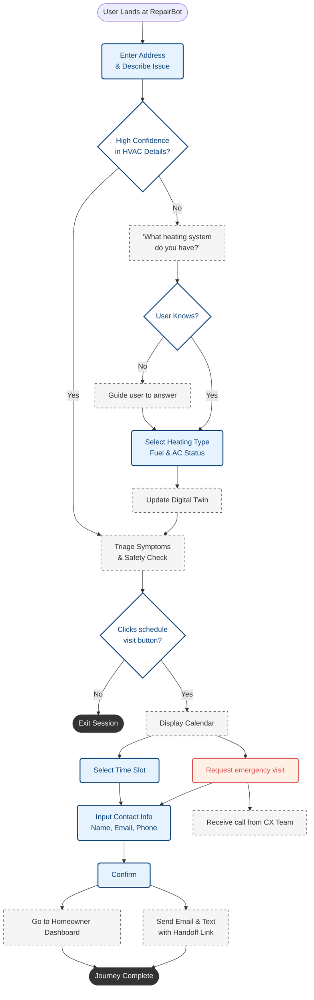

# MVP repair user journey

User journey for repair

```mermaid

flowchart TD
    %% --- STYLING ---
    classDef user fill:#e6f3ff,stroke:#08427b,color:#08427b,stroke-width:2px,rx:5,ry:5;
    classDef system fill:#f5f5f5,stroke:#333333,color:#333333,stroke-width:1px,stroke-dasharray: 5 5;
    classDef logic fill:#ffffff,stroke:#08427b,stroke-width:2px,shape:rhombus,color:#08427b;
    classDef alert fill:#fff0e6,stroke:#d9534f,color:#d9534f,stroke-width:2px,rx:5,ry:5;
    classDef terminator fill:#333,stroke:#333,color:#fff,rx:10,ry:10;

    %% --- STEP 1: LANDING & DATA CHECK ---
    StartNode(["User Lands at RepairBot"]) --> HO_Entry["Enter Address<br/>& Describe Issue"]:::user
    HO_Entry --> Sys_Check{"High Confidence<br/>in HVAC Details?"}:::logic

    %% --- BRANCH: EQUIPMENT IDENTIFICATION ---
    %% Path A: Confidence = Yes
    Sys_Check -- Yes --> Bot_Triage
    
    %% Path B: Confidence = No
    Sys_Check -- No --> Bot_Ask["'What heating system<br/>do you have?'"]:::system
    Bot_Ask --> HO_Know{"User Knows?"}:::logic

    HO_Know -- No --> Bot_Guide["Guide user to answer"]:::system
    Bot_Guide --> HO_Input
    
    HO_Know -- Yes --> HO_Input["Select Heating Type<br/>Fuel & AC Status"]:::user
    HO_Input --> Sys_Twin["Update Digital Twin"]:::system
    Sys_Twin --> Bot_Triage

    %% --- STEP 2: TRIAGE ---
    Bot_Triage["Triage Symptoms<br/>& Safety Check"]:::system
    Bot_Triage --> Dec_Sched{"Clicks schedule<br/>visit button?"}:::logic

    Dec_Sched -- No --> ExitNode(["Exit Session"]):::terminator
    Dec_Sched -- Yes --> Sys_Cal["Display Calendar"]:::system

    %% --- STEP 3: SCHEDULING & CONVERGENCE ---
    Sys_Cal --> HO_Slot["Select Time Slot"]:::user
    Sys_Cal --> HO_Emerg["Request emergency visit"]:::alert

    %% The Convergence: Both paths lead to Contact Info
    HO_Slot --> HO_Contact["Input Contact Info<br/>Name, Email, Phone"]:::user
    HO_Emerg --> HO_Contact

    %% The Emergency Fork: Direct path to Call
    HO_Emerg --> CX_Call["Receive call from CX Team"]:::system

    %% --- STEP 4: CLOSE OUT (Standard Flow) ---
    HO_Contact --> HO_Book["Confirm"]:::user
    
    HO_Book --> HO_Dash["Go to Homeowner Dashboard"]:::system
    HO_Book --> Sys_Notif["Send Email & Text<br/>with Handoff Link"]:::system
    
    HO_Dash --> End_Std(["Journey Complete"]):::terminator
    Sys_Notif --> End_Std
```
