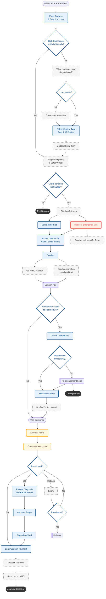

# MVP HO repair user journey

User journey for repair

```mermaid

flowchart TD
    %% --- STYLING ---
    classDef user fill:#e6f3ff,stroke:#08427b,color:#08427b,stroke-width:2px,rx:5,ry:5;
    classDef co fill:#fff8e1,stroke:#ffa000,color:#5d4037,stroke-width:2px,rx:5,ry:5;
    classDef system fill:#f5f5f5,stroke:#333333,color:#333333,stroke-width:1px,stroke-dasharray: 5 5;
    classDef logic fill:#ffffff,stroke:#08427b,stroke-width:2px,shape:rhombus,color:#08427b;
    classDef alert fill:#fff0e6,stroke:#d9534f,color:#d9534f,stroke-width:2px,rx:5,ry:5;
    classDef terminator fill:#333,stroke:#333,color:#fff,rx:10,ry:10;
    classDef subproc fill:#f4f4f4,stroke:#333,stroke-width:2px;

    %% --- STEP 1: LANDING & DATA CHECK ---
    StartNode(["User Lands at RepairBot"]) --> HO_Entry["Enter Address<br/>& Describe Issue"]:::user
    HO_Entry --> Sys_Check{"High Confidence<br/>in HVAC Details?"}:::logic

    %% --- BRANCH: EQUIPMENT IDENTIFICATION ---
    %% Path A: Confidence = Yes
    Sys_Check -- Yes --> Bot_Triage
    
    %% Path B: Confidence = No
    Sys_Check -- No --> Bot_Ask["'What heating system<br/>do you have?'"]:::system
    Bot_Ask --> HO_Know{"User Knows?"}:::logic

    HO_Know -- No --> Bot_Guide["Guide user to answer"]:::system
    Bot_Guide --> HO_Input
    
    HO_Know -- Yes --> HO_Input["Select Heating Type<br/>Fuel & AC Status"]:::user
    HO_Input --> Sys_Twin["Update Digital Twin"]:::system
    Sys_Twin --> Bot_Triage

    %% --- STEP 2: TRIAGE ---
    Bot_Triage["Triage Symptoms<br/>& Safety Check"]:::system
    Bot_Triage --> Dec_Sched{"Clicks schedule<br/>visit button?"}:::logic

    Dec_Sched -- No --> ExitNode(["Exit Session"]):::terminator
    Dec_Sched -- Yes --> Sys_Cal["Display Calendar"]:::system

    %% --- STEP 3: SCHEDULING & CONVERGENCE ---
    Sys_Cal --> HO_Slot["Select Time Slot"]:::user
    Sys_Cal --> HO_Emerg["Request emergency visit"]:::alert

    %% The Convergence: Both paths lead to Contact Info
    HO_Slot --> HO_Contact["Input Contact Info<br/>Name, Email, Phone"]:::user
    HO_Emerg --> HO_Contact

    %% The Emergency Fork: Direct path to Call
    HO_Emerg --> CX_Call["Receive call from CX Team"]:::system

    %% --- STEP 4: CLOSE OUT (Standard Flow) ---
    HO_Contact --> HO_Book["Confirm"]:::user
    
    HO_Book --> HO_Dash["Go to HO Handoff"]:::system
    HO_Book --> Sys_Notif["Send confirmation<br/>email and text"]:::system
    
    HO_Dash --> Confirm_Loop
    Sys_Notif --> Confirm_Loop

    %% --- STEP 5: CONFIRMATION WINDOW (HO PATH) ---
    Confirm_Loop@{ shape: subproc, label: "Confirm visit" }
    Confirm_Loop --> HO_Needs_Change{"Homeowner Needs<br/>to Reschedule?"}:::logic

    HO_Needs_Change -- No --> Visit_Confirmed
    HO_Needs_Change -- Yes --> HO_Cancel["Cancel Current Slot"]:::user

    HO_Cancel --> HO_Resched_Now{"Reschedule<br/>Immediately?"}:::logic

    %% Path A: Immediate Reschedule
    HO_Resched_Now -- Yes --> HO_NewSlot["Select New Time"]:::user
    HO_NewSlot --> Sys_Notify_CO["Notify CO: Job Moved"]:::system
    Sys_Notify_CO --> Visit_Confirmed

    %% Path B: Delayed Reschedule
    HO_Resched_Now -- No --> Proc_Reengage
    Proc_Reengage@{ shape: subproc, label: "Re-engagement Loop" }
    Proc_Reengage --> HO_NewSlot
    Proc_Reengage --> End_Unresponsive(["Unresponsive"]):::terminator

    %% --- STEP 6: ARRIVAL ---
    Visit_Confirmed(["Visit Confirmed"]) --> CO_Arrive["Arrive at Home"]:::co
    CO_Arrive --> CO_Diagnose["CO Diagnoses Issue"]:::co

    %% --- STEP 7: REPAIR DECISION ---
    CO_Diagnose --> Dec_Repair{"Repair work?"}:::logic

    %% Path A: No repair - just pay diagnostic fee
    Dec_Repair -- No --> HO_Pay

    %% Path B: Yes repair - review and approve
    Dec_Repair -- Yes --> HO_View["Review Diagnosis<br/>and Repair Scope"]:::user
    HO_View --> HO_Approve["Approve Scope"]:::user

    %% Path C: Replace - go to Ecom
    Dec_Repair -- Replace --> Ecom["Ecom"]:::system
    Ecom --> Dec_Deposit{"Pay deposit?"}:::logic
    Dec_Deposit -- Yes --> Proc_Delivery
    Proc_Delivery@{ shape: subproc, label: "Delivery" }
    Dec_Deposit -- No --> Dec_Repair

    %% --- STEP 8: COMPLETION & AUTHORIZATION ---
    HO_Approve --> HO_Sign["Sign-off on Work"]:::user
    HO_Sign --> HO_Pay["Enter/Confirm Payment"]:::user

    %% --- STEP 9: SYSTEM PROCESSING ---
    HO_Pay --> Sys_Pay["Process Payment"]:::system
    Sys_Pay --> Sys_Report["Send report to HO"]:::system
    Sys_Report --> End_Journey(["Journey Complete"]):::terminator
```