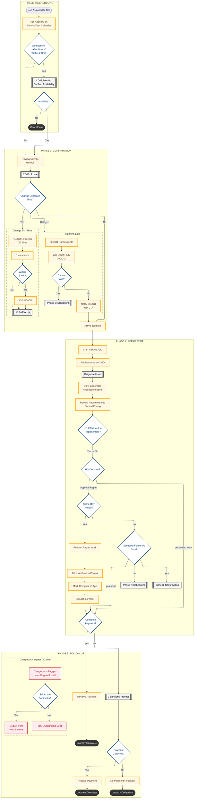

```mermaid
%%{init: {"flowchart": {"defaultRenderer": "elk"}} }%%

flowchart TD
    %% --- STYLING ---
    classDef co fill:#fff8e1,stroke:#ffa000,color:#5d4037,stroke-width:2px
    classDef logic fill:#ffffff,stroke:#08427b,stroke-width:2px,color:#08427b
    classDef terminator fill:#333333,stroke:#333333,color:#ffffff
    classDef subprocess fill:#f4f4f4,stroke:#333333,stroke-width:2px,color:#000000
    classDef monitor fill:#e3f2fd,stroke:#1565c0,color:#0d47a1,stroke-width:2px
    classDef chargeback fill:#ffebee,stroke:#c62828,color:#b71c1c,stroke-width:2px

    %% =============================================
    %% PHASE 2: SCHEDULING
    %% =============================================
    subgraph Phase2[PHASE 2: SCHEDULING]
        direction TB

        %% --- JOB ASSIGNMENT ---
        Start([Job Assigned to CO]) --> CO_JobAppears[Job Appears on<br>ServiceTitan Calendar]:::co

        %% --- EMERGENCY / AFTER-HOURS PATH ---
        CO_JobAppears --> Dec_UrgentFlag{Emergency/<br>After-Hours/<br>Within 2 Hrs?}:::logic

        Dec_UrgentFlag -- Yes --> CO_ReceiveCall[[CO Follow Up:<br>Confirm Availability]]:::subprocess
        CO_ReceiveCall --> Dec_COAvailable{Available?}:::logic
        Dec_COAvailable -- No --> Reassigned([Cancel Visit]):::terminator
    end

    %% --- CROSS-PHASE CONNECTIONS (Phase 2 to Phase 3) ---
    Dec_COAvailable -- Yes --> Review_ServiceHandoff
    Dec_UrgentFlag -- No --> Review_ServiceHandoff

    %% =============================================
    %% PHASE 3: CONFIRMATION
    %% =============================================
    subgraph Phase3[PHASE 3: CONFIRMATION]
        direction TB

        %% --- SERVICE HANDOFF ---
        Review_ServiceHandoff[Review Service<br>Handoff]:::co
        Review_ServiceHandoff --> Monitor_EnRoute[[CO En Route]]:::subprocess

        %% --- CHANGE SCHEDULE TIME DECISION ---
        Monitor_EnRoute --> Dec_ChangeSchTime{Change Schedule<br>Time?}:::logic

        %% --- CHANGE SCH TIME (dotted subgraph) ---
        subgraph ChangeSchTime["Change Sch Time"]
            direction TB
            HO_CO_ReqDiffTime[HO/CO Requests<br>Diff Time]:::co
            HO_CO_ReqDiffTime --> CancelVisit_Sch[Cancel Visit]:::co
            CancelVisit_Sch --> Dec_Within2Hrs{Within<br>2 Hrs?}:::logic
            Dec_Within2Hrs -- Yes --> CallHOCO[Call HO/CO]:::co
            CallHOCO --> CO_Followup[[HO Follow Up]]:::subprocess
            Dec_Within2Hrs -- No --> CO_Followup
        end
        style ChangeSchTime fill:none,stroke:#333333,stroke-dasharray: 5 5

        %% --- RUNNING LATE (dotted subgraph) ---
        subgraph RunningLate["Running Late"]
            direction TB
            HO_CO_Late[HO/CO Running Late]:::co
            HO_CO_Late --> CallOtherParty["Call Other Party<br>(HO/CO)"]:::co
            CallOtherParty --> Dec_CancelVisitLate{Cancel<br>Visit?}:::logic
            Dec_CancelVisitLate -- Yes --> Phase2Scheduling_RL[[Phase 2: Scheduling]]:::subprocess
            Dec_CancelVisitLate -- No --> NotifyWithETA[Notify HO/CO<br>with ETA]:::co
        end
        style RunningLate fill:none,stroke:#333333,stroke-dasharray: 5 5

        %% --- CONNECTIONS FROM DECISION NODE ---
        Dec_ChangeSchTime -- Yes --> ChangeSchTime
        Dec_ChangeSchTime -- Delayed --> RunningLate
        Dec_ChangeSchTime -- No --> CO_Arrive

    end

    %% --- NOTIFY ETA TO VISIT ---
    NotifyWithETA --> CO_Arrive

    %% =============================================
    %% PHASE 4: REPAIR VISIT
    %% =============================================
    subgraph Phase4[PHASE 4: REPAIR VISIT]
        direction TB

        %% --- ARRIVAL ---
        CO_Arrive[Arrive at Home]:::co
        CO_Arrive --> CO_Checkin[Start Visit via App]:::co
        CO_Checkin --> CO_Diagnose

        %% --- DIAGNOSIS ---
        CO_Diagnose[Review Issue with HO]:::co
        CO_Diagnose --> CO_DiagnoseIssue[[Diagnose Issue]]:::subprocess
        CO_DiagnoseIssue --> CO_ViewPricing[View Generated<br>Pricing/Line Items]:::co
        CO_ViewPricing --> CO_ReviewWithHO[Review Recommended<br>Fix and Pricing]:::co
        CO_ReviewWithHO --> Dec_HOInterested{HO Interested in<br>Replacement?}:::logic
        Dec_HOInterested -- "Yes or No" --> Dec_HODecision{HO Decision?}:::logic

        %% --- DECLINE PATH ---
        Dec_HODecision -- decline/no work --> Dec_Complete_Payment

        %% --- APPROVE REPAIR PATH ---
        Dec_HODecision -- Approve Repair --> Dec_SameDay{Same-Day<br>Repair?}:::logic

        %% --- SAME DAY ---
        Dec_SameDay -- Yes --> CO_Execute[Perform Repair Work]:::co
        CO_Execute --> CO_Photo[Take Verification Photos]:::co
        CO_Photo --> CO_Complete[Mark Complete in App]:::co
        CO_Complete --> CO_Sign[Sign Off on Work]:::co
        CO_Sign --> Dec_Complete_Payment{Complete<br>Payment?}:::logic

        %% --- FOLLOW-UP NEEDED ---
        Dec_SameDay -- No --> Dec_FollowSlot{Schedule Follow-Up<br>Visit?}:::logic
        Dec_FollowSlot -- yes --> Phase3_Confirmation[[Phase 3: Confirmation]]:::subprocess
        Dec_FollowSlot -- no --> Phase2_Scheduling[[Phase 2: Scheduling]]:::subprocess
        Dec_FollowSlot -- "yes or no" --> Dec_Complete_Payment
    end

    %% --- CONNECTIONS FROM PHASE 4 TO PHASE 5 ---
    Dec_Complete_Payment -- yes --> CO_ReceivePayment
    Dec_Complete_Payment -- no --> Collections_Sub

    %% =============================================
    %% PHASE 5: FOLLOW UP
    %% =============================================
    subgraph Phase5[PHASE 5: FOLLOW UP]
        direction TB

        %% --- PAYMENT COLLECTED ---
        CO_ReceivePayment[Receive Payment]:::co
        CO_ReceivePayment --> End_Journey([Journey Complete]):::terminator

        %% --- PAYMENT NOT COLLECTED ---
        Collections_Sub[[Collections Process]]:::subprocess
        Collections_Sub --> Dec_CollectionResult{Payment<br>Collected?}:::logic
        Dec_CollectionResult -- Yes --> CO_ReceivePaymentLate[Receive Payment]:::co
        CO_ReceivePaymentLate --> End_JourneyLate([Journey Complete]):::terminator
        Dec_CollectionResult -- No --> CO_NoPayment[No Payment Received]:::co
        CO_NoPayment --> End_Unpaid([Unpaid - Collections]):::terminator

        %% --- CHARGEBACK (if flagged from declined service) ---
        subgraph Chargeback["Chargeback Impact (V2 only)"]
            direction TB
            CB_Flagged[Chargeback Flagged<br>from Original Install]:::chargeback
            CB_Flagged --> Dec_StillActive{Still Active<br>Contractor?}:::logic
            Dec_StillActive -- Yes --> CB_Deduct[Deduct from<br>Next Invoice]:::chargeback
            Dec_StillActive -- No --> CB_Debt[Flag: Outstanding Debt]:::chargeback
        end
        style Chargeback fill:none,stroke:#c62828,stroke-dasharray: 5 5
    end
```
