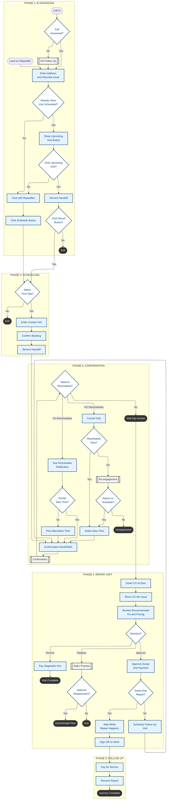

```mermaid
%%{init: {'flowchart':{'defaultRenderer':'elk'}}}%%

flowchart TD
    %% --- STYLING ---
    classDef user fill:#e6f3ff,stroke:#08427b,color:#08427b,stroke-width:2px
    classDef logic fill:#ffffff,stroke:#08427b,stroke-width:2px,color:#08427b
    classDef terminator fill:#333333,stroke:#333333,color:#ffffff
    classDef subprocess fill:#f4f4f4,stroke:#333333,stroke-width:2px

    %% =============================================
    %% PHASE 1: AI DIAGNOSIS
    %% =============================================
    subgraph Phase1[PHASE 1: AI DIAGNOSIS]
        direction TB

        %% --- ENTRY POINTS ---
        StartNode_Web([Land on RepairBot]) --> HO_Entry[Enter Address<br>and Describe Issue]:::user

        StartNode_Call([Call In]) --> Dec_Answer{Call<br>Answered?}:::logic
        Dec_Answer -- Yes --> HO_Entry
        Dec_Answer -- No --> HO_Followup_Sub[[HO Follow Up]]:::subprocess
        HO_Followup_Sub --> HO_Entry

        %% --- RETURN VISITOR ---
        HO_Entry --> Dec_Already_Scheduled{Already Have<br>Visit Scheduled?}:::logic
        Dec_Already_Scheduled -- Yes --> Show_Upcoming_Btn[Show Upcoming<br>Visit Button]:::user
        Show_Upcoming_Btn --> Dec_Click_Upcoming{Click Upcoming<br>Visit?}:::logic
        Dec_Click_Upcoming -- Yes --> Service_Handoff_View[Service Handoff]:::user
        Dec_Click_Upcoming -- No --> HO_Triage
        Service_Handoff_View --> Dec_Click_Resched{Click Resch<br>Button?}:::logic
        Dec_Click_Resched -- No --> Exit_Resched([Exit]):::terminator

        %% --- TRIAGE CONVERSATION ---
        Dec_Already_Scheduled -- No --> HO_Triage[Chat with RepairBot]:::user
        HO_Triage --> Click_Schedule[Click Schedule Button]:::user
    end

    %% --- CROSS-PHASE CONNECTIONS TO SCHEDULING ---
    Click_Schedule --> Dec_Select_Slot
    Dec_Click_Resched -- Yes --> Dec_Select_Slot

    %% =============================================
    %% PHASE 2: SCHEDULING
    %% =============================================
    subgraph Phase2[PHASE 2: SCHEDULING]
        direction TB

        Dec_Select_Slot{Select<br>Time Slot?}:::logic
        Dec_Select_Slot -- Yes --> HO_Contact[Enter Contact Info]:::user
        Dec_Select_Slot -- No --> Exit_Sched([Exit]):::terminator
        HO_Contact --> HO_Book[Confirm Booking]:::user
        HO_Book --> Service_Handoff[Service Handoff]:::user
    end

    Service_Handoff --> Confirm_Email_SMS

    %% =============================================
    %% PHASE 3: CONFIRMATION
    %% =============================================
    subgraph Phase3[PHASE 3: CONFIRMATION]
        direction TB

        Confirm_Email_SMS[Confirmation Email/SMS]:::user
        Confirm_Email_SMS --> Confirm_Loop

        Confirm_Loop[[Confirmation]]:::subprocess
        Confirm_Loop --> Dec_Resched{Need to<br>Reschedule?}:::logic

        Dec_Resched -- No --> Visit_Day([Visit Day Arrives]):::terminator

        %% --- HO RESCHEDULE PATH ---
        Dec_Resched -- HO Reschedules --> HO_Cancel[Cancel Visit]:::user
        HO_Cancel --> Dec_Resched_Now{Reschedule<br>Now?}:::logic
        Dec_Resched_Now -- Yes --> HO_NewSlot[Select New Time]:::user
        HO_NewSlot --> Confirm_Email_SMS
        Dec_Resched_Now -- No --> Reengage_Sub[[Re-engagement]]:::subprocess
        Reengage_Sub --> Dec_Returns{Return to<br>Schedule?}:::logic
        Dec_Returns -- Yes --> HO_NewSlot
        Dec_Returns -- No --> End_Unresponsive([Unresponsive]):::terminator

        %% --- CO RESCHEDULE PATH ---
        Dec_Resched -- CO Reschedules --> See_Reschedule_Notice[See Reschedule<br>Notification]:::user
        See_Reschedule_Notice --> Dec_Accept_New{Accept<br>New Time?}:::logic
        Dec_Accept_New -- Yes --> Confirm_Email_SMS
        Dec_Accept_New -- No --> HO_Pick_Alt[Pick Alternative Time]:::user
        HO_Pick_Alt --> Confirm_Email_SMS
    end

    %% =============================================
    %% PHASE 4: REPAIR VISIT
    %% =============================================
    subgraph Phase4[PHASE 4: REPAIR VISIT]
        direction TB

        %% --- ARRIVAL ---
        Visit_Day --> HO_Greet[Greet CO at Door]:::user
        HO_Greet --> HO_Show_Issue[Show CO the Issue]:::user

        %% --- DIAGNOSIS ---
        HO_Show_Issue --> HO_Review_Scope[Review Recommended<br>Fix and Pricing]:::user
        HO_Review_Scope --> Dec_Repair{Decision?}:::logic

        %% --- DECLINE PATH ---
        Dec_Repair -- Decline --> HO_Pay_Diag[Pay Diagnostic Fee]:::user
        HO_Pay_Diag --> End_DiagOnly([Visit Complete]):::terminator

        %% --- REPLACE PATH ---
        Dec_Repair -- Replace --> Sales_Sub[[Sales Process]]:::subprocess
        Sales_Sub --> Dec_Sales{Approve<br>Replacement?}:::logic
        Dec_Sales -- Yes --> End_Ecom([Ecom/Install Flow]):::terminator
        Dec_Sales -- No --> End_SalesLost([Exit]):::terminator

        %% --- APPROVE REPAIR PATH ---
        Dec_Repair -- Approve --> HO_Approve[Approve Scope<br>and Payment]:::user
        HO_Approve --> Dec_SameDay{Same-Day<br>Repair?}:::logic

        %% --- SAME DAY ---
        Dec_SameDay -- Yes --> HO_Wait_Repair[Wait While<br>Repair Happens]:::user
        HO_Wait_Repair --> HO_Sign[Sign Off on Work]:::user

        %% --- FOLLOW-UP NEEDED ---
        Dec_SameDay -- No --> HO_FollowSlot[Schedule Follow-Up<br>Visit]:::user
        HO_FollowSlot --> Confirm_Email_SMS
    end

    %% =============================================
    %% PHASE 5: FOLLOW UP
    %% =============================================
    subgraph Phase5[PHASE 5: FOLLOW UP]
        direction TB

        HO_Sign --> HO_Pay[Pay for Service]:::user
        HO_Pay --> See_Report[Receive Report]:::user
        See_Report --> End_Journey([Journey Complete]):::terminator
    end
```
