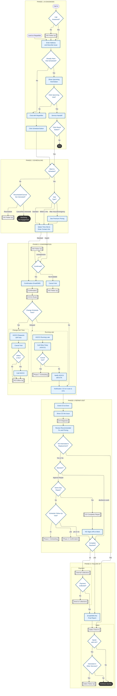

```mermaid
%%{init: {'flowchart':{'defaultRenderer':'elk'}}}%%

flowchart TD
    %% --- STYLING ---
    classDef user fill:#e6f3ff,stroke:#08427b,color:#08427b,stroke-width:2px
    classDef logic fill:#ffffff,stroke:#08427b,stroke-width:2px,color:#08427b
    classDef terminator fill:#333333,stroke:#333333,color:#ffffff
    classDef subprocess fill:#f4f4f4,stroke:#333333,stroke-width:2px
    classDef monitor fill:#e3f2fd,stroke:#1565c0,color:#0d47a1,stroke-width:2px

    %% =============================================
    %% PHASE 1: AI DIAGNOSIS
    %% =============================================
    subgraph Phase1[PHASE 1: AI DIAGNOSIS]
        direction TB

        %% --- ENTRY POINTS ---
        StartNode_Web([Land on RepairBot]) --> HO_Entry[Enter Address<br>and Describe Issue]:::user

        StartNode_Call([Call In]) --> Dec_Answer{Call<br>Answered?}:::logic
        Dec_Answer -- Yes --> HO_Entry
        Dec_Answer -- No --> HO_Followup_Sub[[HO Follow Up]]:::subprocess
        HO_Followup_Sub --> HO_Entry

        %% --- RETURN VISITOR ---
        HO_Entry --> Dec_Already_Scheduled{Already Have<br>Visit Scheduled?}:::logic
        Dec_Already_Scheduled -- Yes --> Show_Upcoming_Btn[Show Upcoming<br>Visit Button]:::user
        Show_Upcoming_Btn --> Dec_Click_Upcoming{Click Upcoming<br>Visit?}:::logic
        Dec_Click_Upcoming -- Yes --> Service_Handoff_View[Service Handoff]:::user
        Dec_Click_Upcoming -- No --> HO_Triage
        Service_Handoff_View --> Dec_Click_Resched{Click Resch<br>Button?}:::logic
        Dec_Click_Resched -- No --> Exit_Resched([Exit]):::terminator

        %% --- TRIAGE CONVERSATION ---
        Dec_Already_Scheduled -- No --> HO_Triage[Chat with RepairBot]:::user
        HO_Triage --> Click_Schedule[Click Schedule Button]:::user
    end

    %% --- CROSS-PHASE CONNECTIONS TO SCHEDULING ---
    Click_Schedule --> Dec_Select_Slot
    Dec_Click_Resched -- Yes --> Dec_Select_Slot

    %% =============================================
    %% PHASE 2: SCHEDULING
    %% =============================================
    subgraph Phase2[PHASE 2: SCHEDULING]
        direction TB

        %% --- SCHEDULING DECISION PATH ---
        Dec_Select_Slot{Want to<br>Schedule?}:::logic

        %% --- NO - RESCHEDULE OR CANCEL PATH ---
        Dec_Select_Slot -- No --> Dec_ReschedOrCancel{Reschedule/Cancel/<br>Not Interested?}:::logic
        Dec_ReschedOrCancel -- Reschedule --> HO_Followup2[[HO Follow Up]]:::subprocess
        Dec_ReschedOrCancel -- Cancel/Not Interested --> Marketing_Reengage([Marketing<br>Re-engagement]):::terminator

        %% --- YES - VISIT TYPE PATH ---
        Dec_Select_Slot -- Yes --> Dec_VisitType{Visit<br>Type?}:::logic

        %% --- AFTER HOURS / EMERGENCY ---
        Dec_VisitType -- After Hours/Emergency --> HO_SeePremium[See Premium Pricing]:::user
        HO_SeePremium --> HO_SelectSlot[Select Time Slot &<br>Enter Contact Info]:::user

        %% --- WITHIN 2 HRS ---
        Dec_VisitType -- Within 2 Hrs --> HO_SelectSlot

        %% --- STANDARD ---
        Dec_VisitType -- Standard --> HO_SelectSlot
    end

    %% --- CONNECTIONS TO PHASE 3 ---
    HO_SelectSlot -- Standard --> Confirm_Email_SMS
    HO_SelectSlot -- Urgent --> Dec_Confirmed

    %% =============================================
    %% PHASE 3: CONFIRMATION
    %% =============================================
    subgraph Phase3[PHASE 3: CONFIRMATION]
        direction TB

        %% --- URGENT CONFIRMATION PATH ---
        Dec_Confirmed{Confirmed?}:::logic
        Dec_Confirmed -- Yes --> Confirm_Email_SMS[Confirmation Email/SMS]:::user

        %% --- NOT AVAILABLE PATH ---
        Dec_Confirmed -- Not Available --> HO_CancelVisit[Cancel Visit]:::user
        HO_CancelVisit --> HO_Followup_Phase3[[HO Follow Up]]:::subprocess

        %% --- UNRESPONSIVE PATH ---
        Dec_Confirmed -- Unresponsive --> HO_Followup_Reminder[[HO Follow Up]]:::subprocess
        HO_Followup_Reminder --> Dec_Confirmed

        %% --- RECEIVE CONFIRMATION ---
        Confirm_Email_SMS --> Monitor_Confirm[[Confirmation]]:::subprocess

        %% --- MONITORING ---
        Monitor_Confirm --> Monitor_EnRoute[[CO En Route]]:::subprocess

        %% --- CHANGE SCHEDULE TIME DECISION ---
        Monitor_EnRoute --> Dec_ChangeSchTime{Change Schedule<br>Time?}:::logic

        %% --- CHANGE SCH TIME (dotted subgraph) ---
        subgraph ChangeSchTime["Change Sch Time"]
            direction TB
            HO_CO_ReqDiffTime[HO/CO Requests<br>Diff Time]:::user
            HO_CO_ReqDiffTime --> CancelVisit_Sch[Cancel Visit]:::user
            CancelVisit_Sch --> Dec_Within2Hrs{Within<br>2 Hrs?}:::logic
            Dec_Within2Hrs -- Yes --> CallHOCO[Call HO/CO]:::user
            CallHOCO --> HO_Followup3[[HO Follow Up]]:::subprocess
            Dec_Within2Hrs -- No --> HO_Followup3
        end
        style ChangeSchTime fill:none,stroke:#333333,stroke-dasharray: 5 5

        %% --- RUNNING LATE (dotted subgraph) ---
        subgraph RunningLate["Running Late"]
            direction TB
            HO_CO_Late[HO/CO Running Late]:::user
            HO_CO_Late --> CallOtherParty["Call Other Party<br>(HO/CO)"]:::user
            CallOtherParty --> Dec_CancelVisitLate{Cancel<br>Visit?}:::logic
            Dec_CancelVisitLate -- Yes --> Phase2Scheduling_RL[[Phase 2: Scheduling]]:::subprocess
            Dec_CancelVisitLate -- No --> NotifyWithETA[Notify HO/CO<br>with ETA]:::user
        end
        style RunningLate fill:none,stroke:#333333,stroke-dasharray: 5 5

        %% --- CONNECTIONS FROM DECISION NODE ---
        Dec_ChangeSchTime -- Yes --> ChangeSchTime
        Dec_ChangeSchTime -- Delayed --> RunningLate
        Dec_ChangeSchTime -- No --> Monitor_VisitStarts
    end

    %% --- NOTIFY ETA TO VISIT ---
    NotifyWithETA --> Monitor_VisitStarts

    %% =============================================
    %% PHASE 4: REPAIR VISIT
    %% =============================================
    subgraph Phase4[PHASE 4: REPAIR VISIT]
        direction TB

        %% --- ARRIVAL ---
        Monitor_VisitStarts[Notification: CO en route & ETA]:::monitor
        Monitor_VisitStarts --> HO_Greet[Greet CO at Door]:::user
        HO_Greet --> HO_Show_Issue[Show CO the Issue]:::user

        %% --- DIAGNOSIS ---
        HO_Show_Issue --> CO_Diagnosis[[CO Diagnosis]]:::subprocess
        CO_Diagnosis --> HO_Review_Scope[Review Recommended<br>Fix and Pricing]:::user
        HO_Review_Scope --> Dec_HOInterested{HO Interested in<br>Replacement?}:::logic
        Dec_HOInterested -- "Yes or No" --> Dec_Repair{Decision?}:::logic

        %% --- DECLINE PATH ---
        Dec_Repair -- decline/no work --> Dec_Complete_Payment{Complete<br>Payment?}:::logic

        %% --- APPROVE REPAIR PATH ---
        Dec_Repair -- Approve Repair --> Dec_SameDay{Same-Day<br>Repair?}:::logic

        %% --- SAME DAY ---
        Dec_SameDay -- Yes --> CO_Completes_Repair[[CO Completes Repair]]:::subprocess
        CO_Completes_Repair --> HO_Sign[HO Signs Off on Work]:::user
        HO_Sign --> Dec_Complete_Payment

        %% --- FOLLOW-UP NEEDED ---
        Dec_SameDay -- No --> Dec_FollowSlot{Schedule Follow-Up<br>Visit?}:::logic
        Dec_FollowSlot -- yes --> Phase3_Confirmation[[Phase 3: Confirmation]]:::subprocess
        Dec_FollowSlot -- no --> Phase2_Scheduling[[Phase 2: Scheduling]]:::subprocess
        Dec_FollowSlot -- "yes or no" --> Dec_Complete_Payment
    end

    %% --- CONNECTIONS FROM PHASE 4 TO PHASE 5 ---
    Dec_HOInterested -- Yes --> Sales_Sub
    Dec_Complete_Payment -- yes --> Final_Report
    Dec_Complete_Payment -- no --> Internal_Collections

    %% =============================================
    %% PHASE 5: FOLLOW UP
    %% =============================================
    subgraph Phase5[PHASE 5: FOLLOW UP]
        direction TB

        %% --- SALES SUBGRAPH ---
        subgraph Sales[Sales]
            direction TB
            Sales_Sub[[Sales Check-in]]:::subprocess
            Sales_Sub --> Dec_SpeakWithHO{Speak<br>with HO?}:::logic
            Dec_SpeakWithHO -- No --> ContinueJourney([Continue Journey]):::terminator
            Dec_SpeakWithHO -- Yes --> Dec_InterestOtherServices{Interested in<br>Other Services?}:::logic
            Dec_InterestOtherServices -- Yes --> SalesFollowup[[Sales Follow Up]]:::subprocess
            Dec_InterestOtherServices -- No --> ContinueJourney
        end

        %% --- PAYMENT SUBGRAPH ---
        subgraph Payment[Payment]
            direction TB
            Internal_Collections[[Internal Collections]]:::subprocess
            Internal_Collections --> Dec_PaymentCollected{Payment<br>Collected?}:::logic
            Dec_PaymentCollected -- No --> SendToCollections[[Send to Collections]]:::subprocess
        end

        %% --- FINAL REPORT ---
        Dec_PaymentCollected -- Yes --> Final_Report
        Final_Report[Email/SMS the<br>Final Report]:::user
        Final_Report --> Sales_Sub
    end
```
