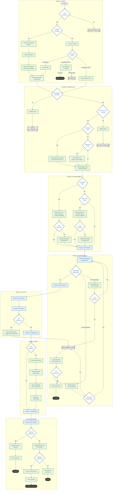

```mermaid

flowchart TD
    %% --- STYLING ---
    classDef user fill:#e6f3ff,stroke:#08427b,color:#08427b,stroke-width:2px
    classDef co fill:#fff8e1,stroke:#ffa000,color:#5d4037,stroke-width:2px
    classDef tetra fill:#e8f5e9,stroke:#2e7d32,color:#1b5e20,stroke-width:2px
    classDef system fill:#f5f5f5,stroke:#333333,color:#333333,stroke-width:1px,stroke-dasharray: 5 5
    classDef logic fill:#ffffff,stroke:#08427b,stroke-width:2px,color:#08427b
    classDef alert fill:#fff0e6,stroke:#d9534f,color:#d9534f,stroke-width:2px
    classDef terminator fill:#333333,stroke:#333333,color:#ffffff
    classDef subprocess fill:#f4f4f4,stroke:#333333,stroke-width:2px,color:#000000
    classDef monitor fill:#e3f2fd,stroke:#1565c0,color:#0d47a1,stroke-width:2px

    %% =============================================
    %% PHASE 1: INTAKE
    %% =============================================
    subgraph Phase1[PHASE 1: INTAKE]
        direction TB
        
        Start([HO Calls In]) --> Dec_Answer{Call<br>Answered?}:::logic
        
        %% =============================================
        %% CALL ANSWERED PATH
        %% =============================================
        Dec_Answer -- Yes --> Dec_Existing{Existing<br>Customer?}:::logic
        
        %% --- NEW CUSTOMER PATH ---
        Dec_Existing -- No --> CSR_CreateNew[Create New Customer<br>in Admin]:::tetra
        CSR_CreateNew --> CSR_OpenRepairBot[Opens RepairBot]:::tetra
        CSR_OpenRepairBot --> CSR_Entry[CSR Enters Address<br>and Issue Description]:::tetra
        CSR_Entry --> CSR_Triage[CSR Guides Triage<br>via RepairBot]:::tetra
        
        %% --- EXISTING CUSTOMER PATH ---
        Dec_Existing -- Yes --> CSR_LookupAdmin[Look up in Admin]:::tetra
        CSR_LookupAdmin --> Dec_RequestType{Request<br>Type?}:::logic
        
        %% --- INSTALL ISSUE ---
        Dec_RequestType -- Install Issue --> CSR_CreateCase[Create Case]:::tetra
        CSR_CreateCase --> CSR_Triage
        
        %% --- QUESTION OR ISSUE ---
        Dec_RequestType -- Question or Issue --> CSR_AttemptHandle[CSR Attempts<br>to Handle]:::tetra
        CSR_AttemptHandle -- Resolved --> CSR_UpdateCase([Updates Case]):::terminator
        CSR_AttemptHandle -- Not Resolved --> Escalation_Sub[[Escalation]]:::subprocess
        
        %% --- CHANGE SCHEDULE TIME ---
        Dec_RequestType -- Change Sch Time --> CSR_CancelOriginal[Cancel Original Visit]:::tetra
        
        %% =============================================
        %% CALL NOT ANSWERED PATH
        %% =============================================
        Dec_Answer -- No --> Customer_Followup[[Customer Follow Up]]:::subprocess
    end

    %% =============================================
    %% PHASE 2: SCHEDULING
    %% =============================================
    subgraph Phase2[PHASE 2: SCHEDULING]
        direction TB
        
        %% --- CHANGE SCHEDULE TIME (from existing customer) ---
        CSR_CancelOriginal --> Dec_Schedule
        
        %% --- NEW BOOKING PATH ---
        CSR_Triage --> Dec_Schedule{HO Wants to<br>Schedule?}:::logic
        
        Dec_Schedule -- No --> CSR_UpdateAdmin[Update Admin]:::tetra
        CSR_UpdateAdmin --> Marketing_Reengage[[Marketing<br>Re-engagement]]:::subprocess
        
        %% --- SCHEDULE PATH ---
        Dec_Schedule -- Yes --> Dec_FindTimeNow{Find New Time<br>on Call?}:::logic
        
        %% Schedule NOW on the call - goes to emergency check
        Dec_FindTimeNow -- Yes --> Dec_Emergency{Emergency<br>Visit?}:::logic
        
        %% Schedule LATER (not on the call)
        Dec_FindTimeNow -- No --> CSR_UpdateAdmin2[Update Admin]:::tetra
        CSR_UpdateAdmin2 --> Customer_Followup2[[Customer Follow Up]]:::subprocess
        
        %% --- EMERGENCY vs AFTER-HOURS ---
        Dec_Emergency -- Yes --> CSR_ValidateEmerg[CSR Validates Emergency<br>Confirms Premium Rate]:::tetra
        CSR_ValidateEmerg --> CSR_Schedule
        
        Dec_Emergency -- No --> Dec_AfterHours{After-Hours<br>Visit?}:::logic
        Dec_AfterHours -- Yes --> CSR_InformAH[CSR Informs HO:<br>After-Hours Surcharge]:::tetra
        CSR_InformAH --> CSR_Schedule
        Dec_AfterHours -- No --> CSR_Schedule
        
        CSR_Schedule[CSR Schedules Visit<br>Confirms Booking]:::tetra
    end

    %% =============================================
    %% PHASE 3: CO ASSIGNMENT
    %% =============================================
    subgraph Phase3[PHASE 3: CO ASSIGNMENT]
        direction TB
        
        CSR_Schedule --> Dec_EmergencyFlag{Emergency<br>Flag?}:::logic
        Dec_EmergencyFlag -- Yes --> Dispatch_Call_Emerg[Dispatch Calls CO:<br>Alert Emergency<br>Confirm Availability]:::tetra
        Dispatch_Call_Emerg --> Dec_CO_Avail_E{CO<br>Available?}:::logic
        Dec_CO_Avail_E -- Yes --> Monitor_Assigned
        Dec_CO_Avail_E -- No --> Dispatch_Reassign_E[Dispatch Reassigns<br>to Available CO]:::tetra
        Dispatch_Reassign_E --> Monitor_Assigned
        
        Dec_EmergencyFlag -- No --> Dec_AHFlag{After-Hours<br>Flag?}:::logic
        Dec_AHFlag -- Yes --> Dispatch_Call_AH[Dispatch Calls CO:<br>Alert After-Hours<br>Confirm Availability]:::tetra
        Dispatch_Call_AH --> Dec_CO_Avail_AH{CO<br>Available?}:::logic
        Dec_CO_Avail_AH -- Yes --> Monitor_Assigned
        Dec_CO_Avail_AH -- No --> Dispatch_Reassign_AH[Dispatch Reassigns<br>to Available CO]:::tetra
        Dispatch_Reassign_AH --> Monitor_Assigned
        
        Dec_AHFlag -- No --> Monitor_Assigned[Monitor: CO Assigned]:::monitor
    end

    %% =============================================
    %% PHASE 4: CONFIRMATION WINDOW
    %% =============================================
    subgraph Phase4[PHASE 4: CONFIRMATION]
        direction TB
        
        Monitor_Assigned --> Monitor_Confirm[Monitor: Confirmation<br>Window Open]:::monitor
        Monitor_Confirm --> Dec_Resched{Reschedule<br>Requested?}:::logic
        
        Dec_Resched -- No --> Monitor_Confirmed[Monitor: Visit Confirmed]:::monitor
        
        Dec_Resched -- HO Reschedules --> Tetra_HOResched[Tetra Processes<br>HO Reschedule]:::tetra
        Tetra_HOResched --> Dec_Immediate{Immediate<br>Reschedule?}:::logic
        Dec_Immediate -- Yes --> Monitor_Confirm
        Dec_Immediate -- No --> Reengage_Loop
        
        Dec_Resched -- CO Reschedules --> Tetra_COResched[Tetra Notifies HO<br>of Time Change]:::tetra
        Tetra_COResched --> Dec_HOAccept{HO<br>Accepts?}:::logic
        Dec_HOAccept -- Yes --> Monitor_Confirm
        Dec_HOAccept -- No --> Reengage_Loop
        
        Reengage_Loop[[Re-engagement Loop]]:::subprocess
        Reengage_Loop --> Tetra_Outreach[Tetra Outreach:<br>SMS, Email, Call]:::tetra
        Tetra_Outreach --> Dec_Respond{HO<br>Responds?}:::logic
        Dec_Respond -- Yes --> Tetra_HOResched
        Dec_Respond -- No --> Tetra_MarkCold[Mark Lead Cold]:::tetra
        Tetra_MarkCold --> End_Cancelled([Cancelled]):::terminator
    end

    %% =============================================
    %% PHASE 5: VISIT DAY
    %% =============================================
    subgraph Phase5[PHASE 5: VISIT DAY]
        direction TB
        
        Monitor_Confirmed --> Monitor_EnRoute[Monitor: CO En Route]:::monitor
        Monitor_EnRoute --> Monitor_Arrived[Monitor: CO Arrived]:::monitor
        
        Monitor_Arrived --> Dec_NoShow{HO<br>No-Show?}:::logic
        Dec_NoShow -- Yes --> Tetra_LogNoShow[Tetra Logs No-Show<br>Triggers Re-engagement]:::tetra
        Tetra_LogNoShow --> Reengage_Loop
        Dec_NoShow -- No --> Monitor_Diagnosing[Monitor: CO Diagnosing]:::monitor
    end

    %% =============================================
    %% PHASE 6: PARTS ORDERING
    %% =============================================
    subgraph Phase6[PHASE 6: PARTS]
        direction TB
        
        Monitor_Diagnosing --> Dec_Parts{Parts<br>Needed?}:::logic
        Dec_Parts -- No --> Monitor_Repair[Monitor: CO Repairing]:::monitor
        
        Dec_Parts -- Yes --> Parts_Alert[Parts Alert Received]:::tetra
        Parts_Alert --> Parts_Order[Parts Coordinator<br>Orders Parts]:::tetra
        Parts_Order --> Parts_Track[Parts Coordinator<br>Tracks Shipment]:::tetra
        Parts_Track --> Parts_Notify[Notify CO:<br>Parts Ready]:::tetra
        Parts_Notify --> Monitor_Repair
    end

    %% =============================================
    %% PHASE 7: PAYMENT COLLECTION
    %% =============================================
    subgraph Phase7[PHASE 7: PAYMENT]
        direction TB
        
        Monitor_Repair --> Monitor_Complete[Monitor: Job Complete]:::monitor
        Monitor_Complete --> Dec_Paid{Payment<br>Collected?}:::logic
        
        Dec_Paid -- Yes --> Billing_Process[Billing Processes<br>Payment]:::tetra
        Billing_Process --> Billing_PayCO[Pay Contractor]:::tetra
        Billing_PayCO --> End_Complete([Complete]):::terminator
        
        Dec_Paid -- No --> Billing_Collection[Billing Reaches Out<br>for Collection]:::tetra
        Billing_Collection --> Dec_Collected{Payment<br>Collected?}:::logic
        Dec_Collected -- Yes --> Billing_Process_Late[Process Late Payment]:::tetra
        Billing_Process_Late --> Billing_PayCO_Late[Pay Contractor]:::tetra
        Billing_PayCO_Late --> End_Late([Complete - Late Pay]):::terminator
        Dec_Collected -- No --> Billing_Flag[Flag: Send to<br>Collections]:::tetra
        Billing_Flag --> End_Unpaid([Unpaid]):::terminator
    end
```