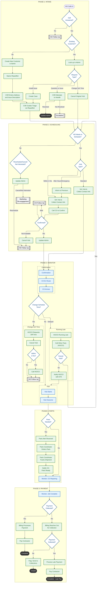

```mermaid
%%{init: {"flowchart": {"defaultRenderer": "elk"}} }%%

flowchart TD
    %% --- STYLING ---
    classDef user fill:#e6f3ff,stroke:#08427b,color:#08427b,stroke-width:2px
    classDef co fill:#fff8e1,stroke:#ffa000,color:#5d4037,stroke-width:2px
    classDef tetra fill:#e8f5e9,stroke:#2e7d32,color:#1b5e20,stroke-width:2px
    classDef system fill:#f5f5f5,stroke:#333333,color:#333333,stroke-width:1px,stroke-dasharray: 5 5
    classDef logic fill:#ffffff,stroke:#08427b,stroke-width:2px,color:#08427b
    classDef alert fill:#fff0e6,stroke:#d9534f,color:#d9534f,stroke-width:2px
    classDef terminator fill:#333333,stroke:#333333,color:#ffffff
    classDef subprocess fill:#f4f4f4,stroke:#333333,stroke-width:2px,color:#000000
    classDef monitor fill:#e3f2fd,stroke:#1565c0,color:#0d47a1,stroke-width:2px

    %% =============================================
    %% PHASE 1: INTAKE
    %% =============================================
    subgraph Phase1[PHASE 1: INTAKE]
        direction TB
        
        Start([HO Calls In]) --> Dec_Answer{Call<br>Answered?}:::logic
        
        %% =============================================
        %% CALL ANSWERED PATH
        %% =============================================
        Dec_Answer -- Yes --> Dec_Existing{Existing<br>Customer?}:::logic
        
        %% --- NEW CUSTOMER PATH ---
        Dec_Existing -- No --> CSR_CreateNew[Create New Customer<br>in Admin]:::tetra
        CSR_CreateNew --> CSR_OpenRepairBot[Opens RepairBot]:::tetra
        CSR_OpenRepairBot --> CSR_Entry[CSR Enters Address<br>and Issue Description]:::tetra
        CSR_Entry --> CSR_Triage[CSR Guides Triage<br>via RepairBot]:::tetra
        
        %% --- EXISTING CUSTOMER PATH ---
        Dec_Existing -- Yes --> CSR_LookupAdmin[Look up in Admin]:::tetra
        CSR_LookupAdmin --> Dec_RequestType{Request<br>Type?}:::logic
        
        %% --- INSTALL ISSUE ---
        Dec_RequestType -- Install Issue --> CSR_CreateCase[Create Case]:::tetra
        CSR_CreateCase --> CSR_Triage
        
        %% --- QUESTION OR ISSUE ---
        Dec_RequestType -- Question or Issue --> CSR_AttemptHandle[CSR Attempts<br>to Handle]:::tetra
        CSR_AttemptHandle -- Resolved --> CSR_UpdateCase([Update Admin]):::terminator
        CSR_AttemptHandle -- Not Resolved --> Escalation_Sub[[Escalation]]:::subprocess
        
        %% --- CHANGE SCHEDULE TIME ---
        Dec_RequestType -- Change Sch Time --> CSR_CancelOriginal[Cancel Original Visit]:::tetra
        
        %% =============================================
        %% CALL NOT ANSWERED PATH
        %% =============================================
        Dec_Answer -- No --> HO_Followup[[HO Follow Up]]:::subprocess
    end

    %% =============================================
    %% PHASE 2: SCHEDULING
    %% =============================================
    subgraph Phase2[PHASE 2: SCHEDULING]
        direction TB
        
        %% --- CHANGE SCHEDULE TIME (from existing customer) ---
        CSR_CancelOriginal --> Dec_Schedule
        
        %% --- NEW BOOKING PATH ---
        CSR_Triage --> Dec_Schedule{HO Wants to<br>Schedule?}:::logic
        
        %% --- NO - RESCHEDULE OR CANCEL PATH ---
        Dec_Schedule -- No --> Dec_ReschedOrCancel{Reschedule/Cancel/<br>Not Interested?}:::logic
        Dec_ReschedOrCancel --> CSR_UpdateAdmin[Update Admin]:::tetra
        CSR_UpdateAdmin -- Reschedule --> HO_Followup2[[HO Follow Up]]:::subprocess
        CSR_UpdateAdmin -- Cancel/Not Interested --> Marketing_Reengage[[Marketing<br>Re-engagement]]:::subprocess
        
        %% --- YES - VISIT TYPE PATH ---
        Dec_Schedule -- Yes --> Dec_VisitType{Visit<br>Type?}:::logic
        
        %% --- AFTER HOURS / EMERGENCY ---
        Dec_VisitType -- After Hours/Emergency --> CSR_InformPremium[Inform of Premium]:::tetra
        CSR_InformPremium --> CSR_SchVisit[Sch Visit &<br>Collect Contact Info]:::tetra
        CSR_SchVisit --> CSR_CallCO[Call CO to Confirm]:::tetra
        CSR_CallCO --> Dec_Confirmed{Confirmed?}:::logic
        Dec_Confirmed -- Yes --> CSR_UpdateAdmin3[Update Admin]:::tetra
        Dec_Confirmed -- Not Available --> CSR_CancelVisit[Cancel Visit]:::tetra
        CSR_CancelVisit --> HO_Followup2
        Dec_Confirmed -- Wait --> CO_Followup[[CO Follow Up]]:::subprocess
        CO_Followup --> Dec_Confirmed
        
        %% --- WITHIN 2 HRS ---
        Dec_VisitType -- Within 2 Hrs --> CSR_SchVisit
        
        %% --- STANDARD ---
        Dec_VisitType -- Standard --> CSR_SchVisitStd[Sch Visit &<br>Collect Contact Info]:::tetra
    end

    %% --- CONNECTIONS TO PHASE 3 ---
    CSR_UpdateAdmin3 --> Monitor_Confirm
    CSR_SchVisitStd --> Monitor_Confirm

    %% =============================================
    %% PHASE 3: MONITOR
    %% =============================================
    subgraph Phase3[PHASE 3: MONITOR]
        direction TB
        
        %% --- CONFIRMATION (dotted subgraph) ---
        subgraph Confirmation["Confirmation"]
            direction TB
            Monitor_Confirm[Confirmation]:::monitor
            Monitor_Confirm --> Monitor_EnRoute[CO En Route]:::monitor
            Monitor_EnRoute --> Monitor_Arrived[CO Arrives]:::monitor
        end
        style Confirmation fill:none,stroke:#333333,stroke-dasharray: 5 5
        
        %% --- CHANGE SCHEDULE TIME DECISION ---
        Confirmation --> Dec_ChangeSchTime{Change Schedule<br>Time?}:::logic
        
        %% --- VISIT (dotted subgraph) ---
        subgraph Visit["Visit"]
            direction TB
            Monitor_VisitStarts[Visit Starts]:::monitor
            Monitor_VisitStarts --> Monitor_VisitOutcome[Visit Outcome]:::monitor
        end
        style Visit fill:none,stroke:#333333,stroke-dasharray: 5 5
        
        %% --- CHANGE SCH TIME (dotted subgraph) ---
        subgraph ChangeSchTime["Change Sch Time"]
            direction TB
            HO_CO_ReqDiffTime[HO/CO Requests<br>Diff Time]:::tetra
            HO_CO_ReqDiffTime --> CancelVisit_Sch[Cancel Visit]:::tetra
            CancelVisit_Sch --> Dec_Within2Hrs{Within<br>2 Hrs?}:::logic
            Dec_Within2Hrs -- Yes --> CallHOCO[Call HO/CO]:::tetra
            CallHOCO --> HO_Followup3[[HO Follow Up]]:::subprocess
            Dec_Within2Hrs -- No --> HO_Followup3
        end
        style ChangeSchTime fill:none,stroke:#333333,stroke-dasharray: 5 5
        
        %% --- RUNNING LATE (dotted subgraph) ---
        subgraph RunningLate["Running Late"]
            direction TB
            HO_CO_Late[HO/CO Running Late]:::tetra
            HO_CO_Late --> CallOtherParty["Call Other Party<br>(HO/CO)"]:::tetra
            CallOtherParty --> Dec_CancelVisitLate{Cancel<br>Visit?}:::logic
            Dec_CancelVisitLate -- Yes --> Dec_Schedule
            Dec_CancelVisitLate -- No --> NotifyWithETA[Notify HO/CO<br>with ETA]:::tetra
        end
        style RunningLate fill:none,stroke:#333333,stroke-dasharray: 5 5
        
        %% --- CONNECTIONS FROM DECISION NODE ---
        Dec_ChangeSchTime -- Yes --> ChangeSchTime
        Dec_ChangeSchTime -- Delayed --> RunningLate
        Dec_ChangeSchTime -- No --> Visit
        
        %% --- NOTIFY ETA TO VISIT ---
        NotifyWithETA --> Visit
    end

    %% --- CONNECTION TO PHASE 4 ---
    Visit --> Dec_Parts

    %% =============================================
    %% PHASE 4: PARTS ORDERING
    %% =============================================
    subgraph Phase4[PHASE 4: PARTS]
        direction TB
        
        Dec_Parts{Parts<br>Needed?}:::logic
        Dec_Parts -- No --> Monitor_Repair[Monitor: CO Repairing]:::monitor
        
        Dec_Parts -- Yes --> Parts_Alert[Parts Alert Received]:::tetra
        Parts_Alert --> Parts_Order[Parts Coordinator<br>Orders Parts]:::tetra
        Parts_Order --> Parts_Track[Parts Coordinator<br>Tracks Shipment]:::tetra
        Parts_Track --> Parts_Notify[Notify CO:<br>Parts Ready]:::tetra
        Parts_Notify --> Monitor_Repair
    end

    %% =============================================
    %% PHASE 5: PAYMENT COLLECTION
    %% =============================================
    subgraph Phase5[PHASE 5: PAYMENT]
        direction TB
        
        Monitor_Repair --> Monitor_Complete[Monitor: Job Complete]:::monitor
        Monitor_Complete --> Dec_Paid{Payment<br>Collected?}:::logic
        
        Dec_Paid -- Yes --> Billing_Process[Billing Processes<br>Payment]:::tetra
        Billing_Process --> Billing_PayCO[Pay Contractor]:::tetra
        Billing_PayCO --> End_Complete([Complete]):::terminator
        
        Dec_Paid -- No --> Billing_Collection[Billing Reaches Out<br>for Collection]:::tetra
        Billing_Collection --> Dec_Collected{Payment<br>Collected?}:::logic
        Dec_Collected -- Yes --> Billing_Process_Late[Process Late Payment]:::tetra
        Billing_Process_Late --> Billing_PayCO_Late[Pay Contractor]:::tetra
        Billing_PayCO_Late --> End_Late([Complete - Late Pay]):::terminator
        Dec_Collected -- No --> Billing_Flag[Flag: Send to<br>Collections]:::tetra
        Billing_Flag --> End_Unpaid([Unpaid]):::terminator
    end
```