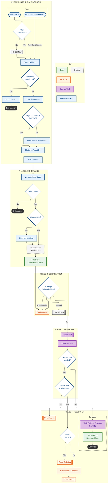

```mermaid

%%{init: {"flowchart": {"defaultRenderer": "elk"}} }%%

flowchart TD
    %% --- STYLING ---
    classDef user fill:#e6f3ff,stroke:#08427b,color:#08427b,stroke-width:2px
    classDef hwecx fill:#fff3e0,stroke:#e65100,color:#bf360c,stroke-width:2px
    classDef tetra fill:#e8f5e9,stroke:#2e7d32,color:#1b5e20,stroke-width:2px
    classDef system fill:#f5f5f5,stroke:#333333,color:#333333,stroke-width:1px,stroke-dasharray: 5 5
    classDef tech fill:#e1bee7,stroke:#7b1fa2,color:#4a148c,stroke-width:2px
    classDef logic fill:#ffffff,stroke:#08427b,stroke-width:2px,color:#08427b
    classDef terminator fill:#333333,stroke:#333333,color:#ffffff
    classDef subprocess fill:#f4f4f4,stroke:#333333,stroke-width:2px,color:#000000

    %% --- KEY/LEGEND ---
    subgraph Key["Key"]
        direction LR
        Key_HO[Homeowner HO]:::user
        Key_HWECX[HWE CX]:::hwecx
        Key_Tetra[Tetra]:::tetra
        Key_Tech[Service Tech]:::tech       
        Key_System[System]:::system
    end

    %% =============================================
    %% PHASE 1: INTAKE & AI DIAGNOSIS
    %% =============================================
    subgraph Phase1[PHASE 1: INTAKE & AI DIAGNOSIS]
        direction TB
        
        %% --- ENTRY POINTS ---
        subgraph Entry["Entry"]
            direction TB
            Start_Web([HO Lands on RepairBot]):::user
            Start_Phone([HO Calls In]):::user
        end

        %% --- WEB PATH ---
        Start_Web -- "New/Install issue" --> User_EntersAddress[Enters Address]:::user
        
        %% --- PHONE PATH ---
        Start_Phone --> Dec_Answer{Call<br>Answered?}:::logic
        Dec_Answer -- Yes --> User_EntersAddress

        Dec_Answer -- No --> Tetra_Callback[[HO sch flow]]:::subprocess
        Tetra_Callback --> User_EntersAddress
        
        %% --- ALREADY SCHEDULED CHECK ---
        User_EntersAddress --> Dec_AlreadyScheduled{Upcoming<br>repair visit?}:::logic
        Dec_AlreadyScheduled -- Yes --> HO_Summary[HO Summary]:::user
        HO_Summary --> Exit_Session([Exit session]):::terminator

        Dec_AlreadyScheduled -- No --> User_DescribesIssue[Describes Issue]:::user

        %% --- DIGITAL TWIN & TRIAGE ---
        User_DescribesIssue --> Dec_Confidence{High Confidence<br>in HVAC?}:::logic
        Dec_Confidence -- No --> HO_ConfirmEquip[HO Confirms Equipment]:::user
        HO_ConfirmEquip --> HO_Triage
        Dec_Confidence -- Yes --> HO_Triage

        HO_Triage[Chat with RepairBot]:::user
        HO_Triage --> HO_ClickSchedule[Click Schedule]:::user
    end

    %% --- CROSS-PHASE CONNECTIONS TO PHASE 2 ---
    HO_ClickSchedule --> Dec_WantsSchedule

    %% =============================================
    %% PHASE 2: SCHEDULING
    %% =============================================
    subgraph Phase2[PHASE 2: SCHEDULING]
        direction TB
        
        Dec_WantsSchedule[View available times]:::user
        Dec_WantsSchedule --> Dec_SelectVisit{Select visit?}:::logic

        Dec_SelectVisit -- Yes --> Dec_ContactInfo{Contact info?}:::logic
        Dec_ContactInfo -- Yes --> Sys_CreateJob[Create Job in<br>ServiceTitan]:::system
        Dec_ContactInfo -- No --> Enter_ContactInfo[Enter contact info]:::user
        Enter_ContactInfo --> Sys_CreateJob

        Dec_SelectVisit -- No --> Exit_Session_Sch([Exit session]):::terminator

        Sys_CreateJob --> Tetra_SendConfirm[Tetra Sends<br>Confirmation Email]:::tetra
    end

    %% --- CROSS-PHASE CONNECTIONS TO PHASE 3 ---
    Tetra_SendConfirm --> HWECX_ManagesVisit

    %% =============================================
    %% PHASE 3: CONFIRMATION
    %% =============================================
    subgraph Phase3[PHASE 3: CONFIRMATION]
        direction TB

        HWECX_ManagesVisit[[Confirmation]]:::hwecx

        HWECX_ManagesVisit --> Dec_ChangeSchedule{Change<br>Schedule Time?}:::logic
        Dec_ChangeSchedule -- Reschedule --> HWECX_ManagesVisit
        Dec_ChangeSchedule -- Cancel --> HO_SchFlow[[HO sch flow]]:::subprocess
    end

    %% --- CROSS-PHASE CONNECTION TO PHASE 4 ---
    Dec_ChangeSchedule -- No --> RepairVisit

    %% =============================================
    %% PHASE 4: REPAIR VISIT
    %% =============================================
    subgraph Phase4[PHASE 4: REPAIR VISIT]
        direction TB

        RepairVisit[[Repair Visit]]:::tech
        RepairVisit --> VisitComplete[Visit Complete]:::tech
        VisitComplete --> Dec_ReturnNeeded{Return visit<br>needed?}:::logic

        Dec_ReturnNeeded -- Yes --> Dec_ReturnSchInHome{Return visit<br>sch in home?}:::logic
    end

    %% --- CROSS-PHASE CONNECTIONS TO PHASE 5 ---
    Dec_ReturnNeeded -- No --> Tech_CollectPayment
    Dec_ReturnSchInHome -- Yes --> Confirmation_InHome
    Dec_ReturnSchInHome -- No --> Dec_PartsNeeded

    %% =============================================
    %% PHASE 5: FOLLOW UP
    %% =============================================
    subgraph Phase5[PHASE 5: FOLLOW UP]
        direction TB

        %% --- PAYMENT ---
        subgraph Payment["Payment"]
            direction TB
            Tech_CollectPayment[Tech Collects Payment<br>from HO]:::tech
            Tech_CollectPayment --> Tetra_BillHWE[Bill HWE for<br>Revenue Share]:::tetra
            Tetra_BillHWE --> Exit_Complete([Complete]):::terminator
        end
        style Payment fill:none,stroke:#333333,stroke-dasharray: 5 5

        %% --- RETURN VISIT SCHEDULING ---
        Confirmation_InHome[[Confirmation]]:::hwecx

        Dec_PartsNeeded{Parts<br>needed?}:::logic
        Dec_PartsNeeded -- Yes --> Parts_Ordering[[Parts Ordering]]:::hwecx
        Dec_PartsNeeded -- No --> HWECX_ScheduleReturn[Schedule Return Visit]:::hwecx
        Parts_Ordering --> HWECX_ScheduleReturn
        HWECX_ScheduleReturn --> Confirmation_Scheduled[[Confirmation]]:::hwecx

    end
```